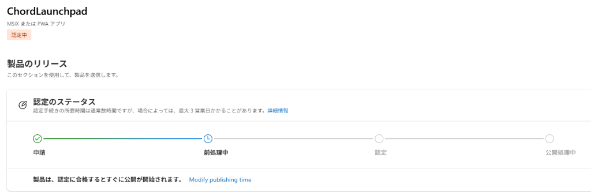

# ChordLaunchpad Ver 2.0

> **コード進行作成支援アプリケーション**  
> 直感的なタイムライン、多彩な記法入力、豊富なテンプレート、そして DAW へのダイレクトな MIDI ドラッグ＆ドロップに対応した Windows 向けコード進行アシスタントツールです。

[](https://github.com/stellorbit/ChordLaunchpad-Ver.2.0/releases/latest)
[-blue)](#システム要件)
[](#)
[](#)

----
## 生成AI使用表明

このアプリケーションは、**Gemini 3.8 Flash** を使用し、制作されたものです。

----

## 概要

ChordLaunchpad は、作曲家・トラックメイカー・DTMer がコード進行をスピーディーにスケッチし、DAW にシームレスに持ち込むための Windows デスクトップアプリケーションです。

ディグリーネーム（ローマ数字）や短縮コマンドでの高速入力、拍や小節構造を反映したビジュアルタイムライン、内蔵シンセによる即時プレビュー、そして生成したコード進行をそのまま DAW（Studio One, Cubase, Pro Tools, Ableton Live, FL Studio 等）のトラックへドラッグ＆ドロップできる強力なワークフローを提供します。

---

## ダウンロードと起動方法

最新版は [Releases ページ](https://github.com/stellorbit/ChordLaunchpad-Ver.2.0/releases/latest) からダウンロードできます。  
環境に合わせて以下の 2 種類の形式から選択いただけます（どちらも .NET ランタイム同梱で、事前インストール不要で動作します）。

### 1. インストーラー版（推奨）
- ファイル名: `ChordLaunchpad_v2.0.0_Setup.exe`
- ダウンロードした EXE をダブルクリックしてウィザードに沿って進めるだけで、デスクトップおよびスタートメニューにショートカットが作成されます。
- 管理者権限不要（ユーザー環境）で安全にインストールでき、Windows の「設定 > アプリ」からアンインストールも可能です。

### 2. ポータブル版（インストール不要）
- ファイル名: `ChordLaunchpad_v2.0.0_Portable_win-x64.zip`
- ZIP を任意のフォルダーに展開し、直下にある **`ChordLaunchpad.exe`** をダブルクリックするだけで即座に起動します。
- システム DLL やリソースはすべて `app/` サブフォルダー内に整理・隔離されているため、フォルダー内がスッキリしています。

### 3. winget によるインストール (Windows 10 / 11)
Windows ターミナルまたは PowerShell から以下のコマンドで直接インストールできます：
```powershell
winget install Stellorbit.ChordLaunchpad
```

### 4. Microsoft Store 版（審査・認定中）
現在、Microsoft パートナーセンターにて公式ストア審査・認定申請中です。  
認定完了後、Microsoft Store よりワンクリック導入（SmartScreen 警告なし）および自動更新に対応いたします。




---

## システム要件

- **OS**: Windows 10 (バージョン 1809 / 17763 以降) または Windows 11 (64-bit)
- **アーキテクチャ**: x64
- **ランタイム**: 不要（自己完結型パッケージのため、.NET やランタイムの事前インストールは必要ありません）

---

## 主要な機能 (Key Features)

### 1. 多彩で直感的なコード入力・記法パース
- **ローマ数字（ディグリー）入力**:  
  `I V vi IV` や `IVmaj7 V7 vim7 I` のように、度数によるコード進行の入力に対応。キーや調性を変更しても自動的に適切なコードネームへトランスポーズされます。
- **短縮コマンド入力（アラビア数字記法）**:  
  キーボードだけで素早く入力可能な短縮表記に対応（例: `4mas 3svn 6mis 1svn` → Fmaj7, E7, Am7, C7）。
- **拍・小節構造の自由な指定**:  
  小節線（`|`）、音価延長・タイ（`-`）、明示的な拍数指定（`(2)/8` など）をサポート。変拍子やシンコペーションを含む自由なリズム設計が可能です。
- **分数コード（オンベース）**:  
  `G/B` や `C/E`、`IV/V` など、ルート音とベース音が異なるコードを正確に指定できます。
- **借用和音・モーダルインターチェンジ**:  
  `bVI` や `bVII` などの臨時記号付きローマ数字も正確に解釈されます。

### 2. ビジュアルタイムラインとリアルタイム試聴プレビュー
- **ブロック型タイムライン UI**:  
  小節と拍数に応じた幅でコードブロックが配置され、進行全体の構成を一目で把握可能。
- **スペースキーによる即時再生・停止**:  
  キーボードの Space キーを押すだけでタイムライン全体をプレビュー再生。再生ヘッドがタイムライン上をスムーズに同期移動します。
- **3 種類の内蔵シンセサイザー音色**:  
  - **Piano**: ピアノらしいアタックと減衰を持つ万能音色
  - **Pad**: 和音の美しい響きや音の広がりを確認しやすい豊かな持続音
  - **Organ**: クリアな発音でコードの輪郭を捉えやすいオルガン音
- **音割れ防止ソフトリミッター**:  
  重低音や 8 音以上の密集テンション和音を最大音量で鳴らしても、クリッピングノイズ（音割れ）を起こさず安全に再生します。

### 3. 豊富な進行テンプレートとユーザー定義管理
- **50 種類以上の組み込みプリセット**:  
  王道進行、小室進行、カノン進行、ジャズ・ツーファイブワン（II-V-I）、R&B・ネオソウル、City Pop、ロックなど、定番からモダンな進行まで幅広く網羅。
- **自作テンプレートの登録・編集 (User Templates)**:  
  作成したオリジナルのコード進行に名前・カテゴリ・解説をつけて保存可能。次回以降のプロジェクトでもいつでも呼び出せます。
- **ダイアトニックコード＆サジェスト機能**:  
  現在のキーに応じたダイアトニック和音の一覧や、機能和音（トニック・ドミナント・サブドミナント）に基づいた次コードのサジェストを表示。

### 4. DAW へのダイレクト MIDI 連携
- **タイムラインからのドラッグ＆ドロップ**:  
  タイムライン上のコード進行をマウスで掴み、そのまま DAW（Studio One, Cubase, Pro Tools, Ableton Live, FL Studio, Logic など）のトラックへ直接ドラッグ＆ドロップするだけで、MIDI クリップとして貼り付けできます。
- **標準 MIDI ファイル (SMF .mid) エクスポート**:  
  プロジェクトの進行を標準 MIDI ファイル（Type 0）としてファイル保存可能。

### 5. DAW 互換ショートカットとスムーズなズーム操作
- **主要 DAW スタイルのズームキーバインド**:  
  普段お使いの DAW に合わせてショートカットスタイルを選択可能：
  - **Pro Tools スタイル**（R / T キーによる水平ズーム）
  - **Cubase スタイル**（G / H キーによる水平ズーム）
  - **Studio One スタイル**（W / E キーによる水平ズーム）
  - **Premiere / DaVinci Resolve スタイル**（= / - キーによるズーム）
  - **テンキーズーム**（テンキーの `+` / `-`）
  - **マウスホイールズーム**（Ctrl + ホイールスクロール）
  - **カスタムスタイル**（お好みのキーを自由に割り当て）

### 6. 自動保存 (AutoSave) と世代別バックアップ管理
- **バックアップの自動生成**:  
  指定した間隔（デフォルト: 5分）ごとに、プロジェクト専用の `Project Backup` フォルダーへ連番付き（例: `MySong_backup_01.chord`）で自動バックアップを保存。
- **プロジェクトフォルダー構造化**:  
  新規プロジェクト作成時に「本体ファイル」「Project Backup フォルダー」「Chord MIDI フォルダー」を自動生成し、制作データの紛失や混濁を防ぎます。

### 7. 多言語対応 (Localization)
- 日本語 UI および 英語 UI の完全切り替えに対応。設定ダイアログからワンクリックで即座に切り替わります。

---

## 開発・ビルド

### 必要環境
- [.NET 10 SDK](https://dotnet.microsoft.com/download/dotnet/10.0)
- Visual Studio 2026 / Visual Studio Build Tools
- Inno Setup 6（インストーラー生成時）

### ビルドとテストの実行
```powershell
# クリーン & ビルド & 単体テスト（全58件）の一括実行
pwsh -File H:\Antigravity\ChordLaunchpad-v2\build.ps1

# 配布パッケージ（ポータブル版ZIP & インストーラーEXE）の一括生成
pwsh -File H:\Antigravity\ChordLaunchpad-v2\package.ps1
```

---

## ライセンス / 作者

- **作成者**: stellorbit
- **リポジトリ**: [https://github.com/stellorbit/ChordLaunchpad-Ver.2.0](https://github.com/stellorbit/ChordLaunchpad-Ver.2.0)
