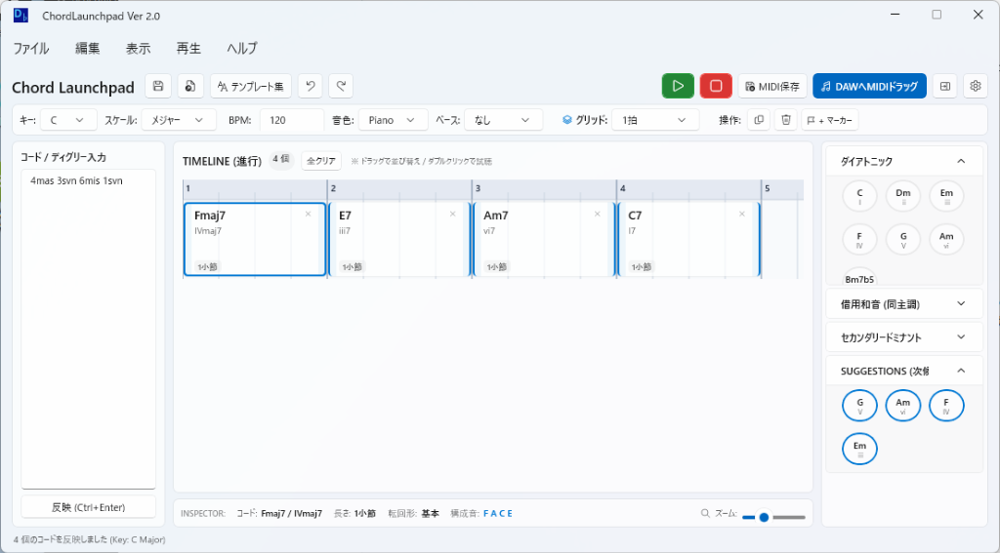

# ChordLaunchpad Ver 2026.09

> **コード進行作成支援アプリケーション**  
> 直感的なタイムライン、多彩な記法入力、豊富なテンプレート、そして DAW へのダイレクトな MIDI ドラッグ＆ドロップに対応した Windows 向けコード進行アシスタントツールです。

[](https://github.com/stellorbit/ChordLaunchpad-Ver.2.0/releases/latest)
[-blue)](#システム要件)
[](#)
[](#)

----
## 生成AI使用表明

このアプリケーションは、**Gemini 3.8 Flash** を使用し、制作されたものです。

----

## 最新バージョン情報 (Ver 2026.09)

本バージョンでは、バージョン表記体系の改訂、セキュリティ・堅牢性の向上、および操作性・UI不具合の全面的な見直しと改善を実施いたしました。

### 1. バージョン表記の変更
- 年月表記による **Ver 2026.09** 体系へ完全移行しました。

### 2. 脆弱性修正・セキュリティ堅牢化
- **パストラバーサル脆弱性の対策**: プロジェクト保存・開く処理および設定のインポート/エクスポートにおけるファイルパス検証（`Path.GetFullPath` による正規化、危険な拡張子チェック、プロジェクトディレクトリ境界外への書き込み防止）を徹底しました。
- **入力サニタイズ・DoS攻撃対策**: テキストボックス入力の文字数制限（最大4,000文字）、制御文字・不正記号の除去サニタイズ、不正なコード進行文字列や無限ループ・メモリ枯渇を引き起こすパース例外を安全に防御しました。
- **プロジェクト保存・バックアップの安全性強化**: 初回起動時の保存先フォルダ明示的指定ダイアログ新設、終了時の保存確認、未保存時の一時作業ディレクトリの安全な自動破棄、および Atomic な一時ファイル置換書き込みによるファイル破損防止を実装しました。

### 3. UI・操作性の改善・不具合修正
- **テキスト反映後のタイムライン自動フォーカス移動**: テキスト入力欄（左ペイン）で `Ctrl+Enter` または「反映」クリック後、操作フォーカスが中央タイムラインへ即座に移動し、そのまま Space キーで試聴・再生が可能になりました。
- **アクティブフォーカス枠の視覚化**: テキスト入力エリアとタイムラインエリアの外枠にアクティブ表示枠（アクセントカラーハイライト）を実装し、現在どちらのエリアに操作権があるかを一目で把握できるようになりました。
- **BPM UIの刷新と「Tap」ボタン新設**: 上部バーの「BPM」をテキスト化し、隣に「Tap」ボタンを新設。[T] キーによるタップテンポ機能を移設しました。
- **タップテンポが2拍で途切れる不具合の修正＆Enter確定**: BPMボックス値変更時の意図しないフォーカス移動バグを解消。タップテンポ計測を安定化させ、[Enter] または [Escape] キーで確定してタイムラインへフォーカスを復帰する機能を追加しました。
- **柔軟なテキスト入力記法と規定音価の変更**: `4536` や `4-5-3-6` などの連続入力への対応、規定音価を「1小節」に統一、起動時のテキスト・タイムライン初期化を空白化しました。
- **キー変更時のタイムライン再パース不具合修正**: キー変更時にタイムラインの内部進行が正しく反映されるよう改善しました。
- **テンプレート集試聴のテンポ同期**: テンプレート試聴時のコード鳴動音価を現在のテンポに合わせた「2拍」に設定しました。

----

## 概要

ChordLaunchpad は、作曲家・トラックメイカー・DTMer がコード進行をスピーディーにスケッチし、DAW にシームレスに持ち込むための Windows デスクトップアプリケーションです。

ディグリーネーム（ローマ数字）や短縮コマンドでの高速入力、拍や小節構造を反映したビジュアルタイムライン、内蔵シンセによる即時プレビュー、そして生成したコード進行をそのまま DAW（Studio One, Cubase, Pro Tools, Ableton Live, FL Studio 等）のトラックへドラッグ＆ドロップできる強力なワークフローを提供します。



---

## ダウンロードと起動方法

最新版は [Releases ページ](https://github.com/stellorbit/ChordLaunchpad-Ver.2.0/releases/latest) からダウンロードできます。  
環境に合わせて以下の 2 種類の形式から選択いただけます（どちらも .NET ランタイム同梱で、事前インストール不要で動作します）。

### 1. インストーラー版（推奨）
- ファイル名: `ChordLaunchpad_v2026.09_Setup.exe`
- ダウンロードした EXE をダブルクリックしてウィザードに沿って進めるだけで、デスクトップおよびスタートメニューにショートカットが作成されます。
- 管理者権限不要（ユーザー環境）で安全にインストールでき、Windows の「設定 > アプリ」からアンインストールも可能です。

### 2. ポータブル版（インストール不要）
- ファイル名: `ChordLaunchpad_v2026.09_Portable_win-x64.zip`
- ZIP を任意のフォルダーに展開し、直下にある **`ChordLaunchpad.exe`** をダブルクリックするだけで即座に起動します。
- システム DLL やリソースはすべて `app/` サブフォルダー内に整理・隔離されているため、フォルダー内がスッキリしています。

### 3. winget によるインストール (Windows 10 / 11)
Windows ターミナルまたは PowerShell から以下のコマンドで直接インストールできます：
```powershell
winget install Stellorbit.ChordLaunchpad
```

### 4. Microsoft Store 版
Microsoft Storeからダウンロード可能です。
更新直後は認定にタイムラグがあるため、最新版をすぐにダウンロードできない可能性があります。

<a href="https://apps.microsoft.com/detail/9MXX63FMGK4S?referrer=appbadge&mode=full" target="_blank"  rel="noopener noreferrer">
	
</a>


---

## システム要件

- **OS**: Windows 10 (バージョン 1809 / 17763 以降) または Windows 11 (64-bit)
- **アーキテクチャ**: x64
- **ランタイム**: 不要（自己完結型パッケージのため、.NET やランタイムの事前インストールは必要ありません）

---

## 主要な機能 (Key Features)

### 1. 多彩で直感的なコード入力・記法パース
- **ローマ数字（ディグリー）入力**:  
  `I V vi IV` や `IVmaj7 V7 vim7 I` のように、度数によるコード進行の入力に対応。キーや調性を変更しても自動的に適切なコードネームへトランスポーズされます。
- **短縮コマンド入力（アラビア数字記法）**:  
  キーボードだけで素早く入力可能な短縮表記に対応（例: `4mas 3svn 6mis 1svn` → Fmaj7, E7, Am7, C7）。
- **拍・小節構造の自由な指定**:  
  小節線（`|`）、音価延長・タイ（`-`）、明示的な拍数指定（`(2)/8` など）をサポート。変拍子やシンコペーションを含む自由なリズム設計が可能です。
- **分数コード（オンベース）**:  
  `G/B` や `C/E`、`IV/V` など、ルート音とベース音が異なるコードを正確に指定できます。
- **借用和音・モーダルインターチェンジ**:  
  `bVI` や `bVII` などの臨時記号付きローマ数字も正確に解釈されます。

### 2. ビジュアルタイムラインとリアルタイム試聴プレビュー
- **ブロック型タイムライン UI**:  
  小節と拍数に応じた幅でコードブロックが配置され、進行全体の構成を一目で把握可能。
- **スペースキーによる即時再生・停止**:  
  キーボードの Space キーを押すだけでタイムライン全体をプレビュー再生。再生ヘッドがタイムライン上をスムーズに同期移動します。
- **3 種類の内蔵シンセサイザー音色**:  
  - **Piano**: ピアノらしいアタックと減衰を持つ万能音色
  - **Pad**: 和音の美しい響きや音の広がりを確認しやすい豊かな持続音
  - **Organ**: クリアな発音でコードの輪郭を捉えやすいオルガン音
- **音割れ防止ソフトリミッター**:  
  重低音や 8 音以上の密集テンション和音を最大音量で鳴らしても、クリッピングノイズ（音割れ）を起こさず安全に再生します。

### 3. 豊富な進行テンプレートとユーザー定義管理
- **50 種類以上の組み込みプリセット**:  
  王道進行、小室進行、カノン進行、ジャズ・ツーファイブワン（II-V-I）、R&B・ネオソウル、City Pop、ロックなど、定番からモダンな進行まで幅広く網羅。
- **自作テンプレートの登録・編集 (User Templates)**:  
  作成したオリジナルのコード進行に名前・カテゴリ・解説をつけて保存可能。次回以降のプロジェクトでもいつでも呼び出せます。
- **ダイアトニックコード＆サジェスト機能**:  
  現在のキーに応じたダイアトニック和音の一覧や、機能和音（トニック・ドミナント・サブドミナント）に基づいた次コードのサジェストを表示。

### 4. DAW へのダイレクト MIDI 連携
- **タイムラインからのドラッグ＆ドロップ**:  
  タイムライン上のコード進行をマウスで掴み、そのまま DAW（Studio One, Cubase, Pro Tools, Ableton Live, FL Studio, Logic など）のトラックへ直接ドラッグ＆ドロップするだけで、MIDI クリップとして貼り付けできます。
- **標準 MIDI ファイル (SMF .mid) エクスポート**:  
  プロジェクトの進行を標準 MIDI ファイル（Type 0）としてファイル保存可能。

### 5. DAW 互換ショートカットとスムーズなズーム操作
- **主要 DAW スタイルのズームキーバインド**:  
  普段お使いの DAW に合わせてショートカットスタイルを選択可能：
  - **Pro Tools スタイル**（R / T キーによる水平ズーム）
  - **Cubase スタイル**（G / H キーによる水平ズーム）
  - **Studio One スタイル**（W / E キーによる水平ズーム）
  - **Premiere / DaVinci Resolve スタイル**（= / - キーによるズーム）
  - **テンキーズーム**（テンキーの `+` / `-`）
  - **マウスホイールズーム**（Ctrl + ホイールスクロール）
  - **カスタムスタイル**（お好みのキーを自由に割り当て）

### 6. 自動保存 (AutoSave) と世代別バックアップ管理
- **バックアップの自動生成**:  
  指定した間隔（デフォルト: 5分）ごとに、プロジェクト専用の `Project Backup` フォルダーへ連番付き（例: `MySong_backup_01.chord`）で自動バックアップを保存。
- **プロジェクトフォルダー構造化**:  
  新規プロジェクト作成時に「本体ファイル」「Project Backup フォルダー」「Chord MIDI フォルダー」を自動生成し、制作データの紛失や混濁を防ぎます。

### 7. 多言語対応 (Localization)
- 日本語 UI および 英語 UI の完全切り替えに対応。設定ダイアログからワンクリックで即座に切り替わります。

---

## 開発・ビルド

### 必要環境
- [.NET 10 SDK](https://dotnet.microsoft.com/download/dotnet/10.0)
- Visual Studio 2026 / Visual Studio Build Tools
- Inno Setup 6（インストーラー生成時）

### ビルドとテストの実行
```powershell
# クリーン & ビルド & 単体テスト（全58件）の一括実行
pwsh -File H:\Antigravity\ChordLaunchpad-v2\build.ps1

# 配布パッケージ（ポータブル版ZIP & インストーラーEXE）の一括生成
pwsh -File H:\Antigravity\ChordLaunchpad-v2\package.ps1
```

---

## ライセンス / 作者

- **作成者**: stellorbit
- **リポジトリ**: [https://github.com/stellorbit/ChordLaunchpad-Ver.2.0](https://github.com/stellorbit/ChordLaunchpad-Ver.2.0)
